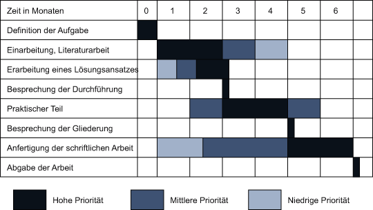

# Zeitplan

| Aufgabe | Zeitraum | Erledigt |
| --- | --- | --- |
| Definition der Aufgabe | 01.04 - 01.05 | x |
| Literaturrecherche | 01.05 - 01.06 |
| Lösungsansatz Erarbeiten | 22.05 - 01.07 |
| Einarbeitung | 01.06 - 01.07 |
| Schreiben: Stand der Forschung | 22.05 - 15.06 |
| Schreiben: Grundlagen | 15.06 - 01.07 |
| Durchführung Besprechung | 01.07 |
| Implementierung | 01.07 - 01.08 |
| Schreiben: Lösungansatz | 01.07 - 15.07 |
| Schreiben: Ausführung der Lösung | 15.07 - 01.08 |
| Gliederungsabsprache | 01.08 |
| Schreiben: Ergebnisse | 01.08 - 15.08 |
| Schreiben: Diskussion | 15.08 - 01.09 |
| Schreiben: Zusammenfassung & Probelesen | 01.09 - 01.10 |
